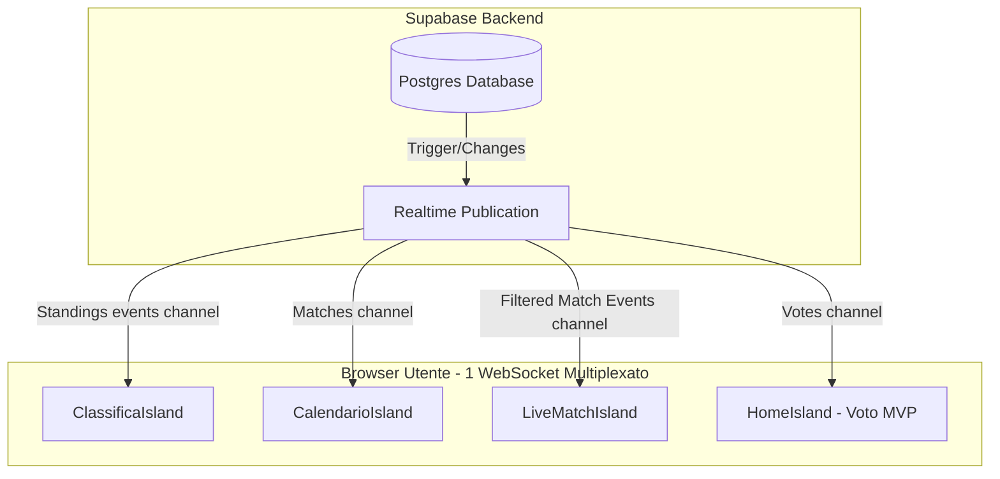

# Design Architetturale Realtime - The Cage

Questo documento descrive le specifiche di implementazione e i pattern di ottimizzazione da adottare per rendere le sottoscrizioni in tempo reale stabili, reattive e performanti sotto carico (~50+ utenti concorrenti).

---

## 1. Architettura dei Canali e Flusso dei Dati

Il diagramma seguente mostra come i client comunicano con Supabase tramite un singolo WebSocket multiplexato, e come gli aggiornamenti vengono propagati ai vari componenti:

---

## 2. Dettaglio delle Ottimizzazioni per Componente

### A. Classifica & Marcatori (`ClassificaIsland.tsx`)
*   **Problema attuale**: I dati vengono recuperati con una cache di 5 minuti. Se l'admin termina una partita e aggiorna i punteggi, la classifica rimane obsoleta per gli utenti attivi.
*   **Soluzione efficiente**:
    1. Creare un canale realtime dedicato `classifica_updates`.
    2. Ascoltare le modifiche alla tabella `matches` (solo per righe con `status = 'TERMINATA'`).
    3. Ascoltare gli inserimenti/cancellazioni nella tabella `match_events` (solo per `type = 'GOAL'`).
    4. All'attivazione di uno di questi eventi, svuotare le chiavi di cache `cage-standings` e `cage-top-scorers` ed eseguire un re-fetch.
    5. Utilizzare un **debounce** di 2 secondi sulle re-fetch per evitare chiamate multiple al DB se vengono inseriti più gol in rapida successione o se il match live viene aggiornato frequentemente.

### B. Calendario (`CalendarioIsland.tsx`)
*   **Problema attuale**: Ascolta qualsiasi cambiamento sulla tabella `matches` ed esegue una fetch completa del calendario.
*   **Soluzione efficiente**:
    1. Mantenere la sottoscrizione realtime ma ottimizzare la query di caricamento.
    2. Anziché invalidare la cache indiscriminatamente, aggiornare lo stato locale integrando la singola riga modificata nel payload realtime (se contiene i dati pre-joinati delle squadre), oppure procedere con la fetch ma salvando il risultato aggiornato direttamente nella cache SWR, aumentando le prestazioni nel passaggio tra le pagine.

### C. Live Match (`LiveMatchIsland.tsx`)
*   **Problema attuale**: Il componente ascolta tutti gli eventi di tutti i match (`*` su `match_events`), sovraccaricando i client se ci sono altre partite giocate o eventi in database.
*   **Soluzione efficiente**:
    1. Recuperare l'ID del match in diretta al mount.
    2. Sottoscrivere al canale realtime applicando il filtro `match_id=eq.<ID_PARTITA>` sulla tabella `match_events`.
    3. Per gli aggiornamenti del punteggio della partita (`matches`), applicare il filtro `id=eq.<ID_PARTITA>` sulla tabella `matches`.
    4. Questo riduce la banda consumata da ogni client a soli ~5-10 KB per l'intero match, inviando solo i messaggi strettamente pertinenti a quel tab.

### D. Dashboard Admin (`Dashboard.tsx` & co)
*   **Problema attuale**: La dashboard admin è statica. Se ci sono più admin connessi o se il database viene modificato da script, la vista non è sincronizzata.
*   **Soluzione efficiente**:
    1. Aggiungere una sottoscrizione realtime in `Dashboard.tsx` che ascolta `matches` e `teams`/`players`.
    2. Aggiornare lo stato centralizzato re-innescando le funzioni `refreshMatches()` e `refreshTeams()`.
    3. In questo modo, qualsiasi modifica fatta da un admin si riflette all'istante anche sulle dashboard di tutti gli altri amministratori.

---

## 3. Gestione e Riduzione del Carico (50+ Utenti)

Per garantire la stabilità del servizio con Supabase gratuito:

1. **Unsubscribe Rigoroso**:
   Tutte le sottoscrizioni devono essere rimosse nel metodo di pulizia (`cleanup`) di `useEffect` tramite `supabase.removeChannel(channel)`. La mancata disconnessione dei canali causerebbe leak di connessioni WebSocket su Supabase, superando rapidamente il limite di 200 connessioni simultanee.
   
2. **Evitare Query "N+1" al Ricevimento dei Messaggi**:
   Se riceviamo una notifica realtime che un voto è stato inserito, non dobbiamo rieseguire una query per contare tutti i voti. Dobbiamo invece aggiornare lo stato React incrementando il contatore locale di `+1` (come già parzialmente implementato in `HomeIsland.tsx`).
   
3. **Pulsante di "Forza Sincronizzazione" (Fallback)**:
   In caso di problemi di rete temporanei che interrompono la connessione WebSocket, prevedere un micro-pulsante o un indicatore dello stato di connessione realtime ("Connesso 🟢" / "Disconnesso 🔴") che permetta all'utente di forzare il rinfresco manuale dei dati.
